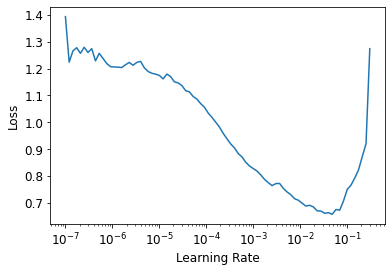

# Deep-Learning-Projects
Deep Learning Related Projects

# Cats Vs Dogs Classifier with 99% accuracy in 7 Epochs
### The Data set contained 25000 entries of cats and dogs. Managed to get accuracy of 99% in less than 7 Epochs

### Confusion Matrix
Confusion matrix showed that classifier needs to be performing better on dogs.

### Most lossses 
When I plotted the loss i found out that most of the dogs were misclassified because there is a kind of distortion in it.

